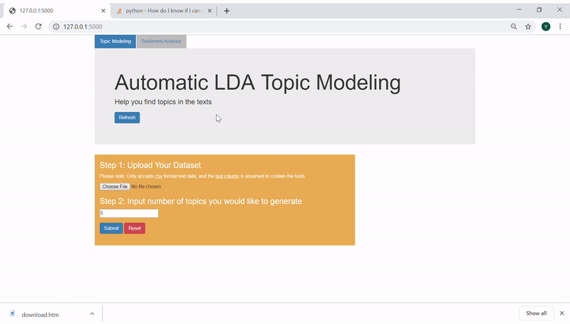

# Flask NLP Web Application
A web application where you can do Automatic LDA Topic Modeling on the text data

LDA Topic Modeling is a type of machine learning model that helps to extrac 'topics' from a collection of documents. The goal of this flask project is to develop a user interface that embeds the LDA Topic Modeling algorithms, and make it easy for even non-technical people to extract topics from any texts data.

- Text Preprocessing: Tokenization, Stopwords Removal, Stemming and Lemmatization
- LDA Topic Modeling
- Flask Web Application as a user interface

# Flask Demo
1. Just upload a csv that contains texts, and select number of topics you want to see

2. LDA is ran in the back end and results are shown:

- LDA outputs on the left side
- Data overview on the right side
- Topics, Probability of that Topic, Topic Keywords are added to the dateset

